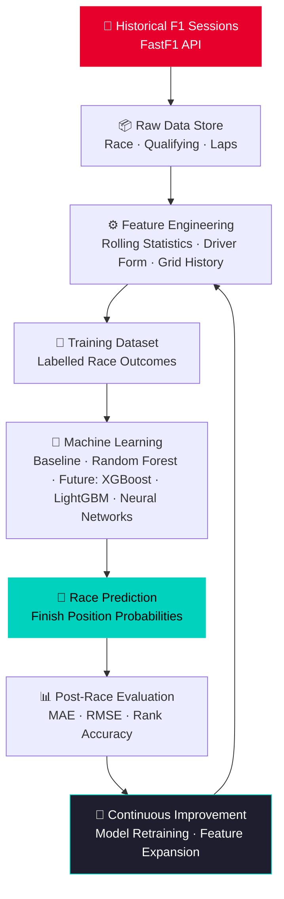
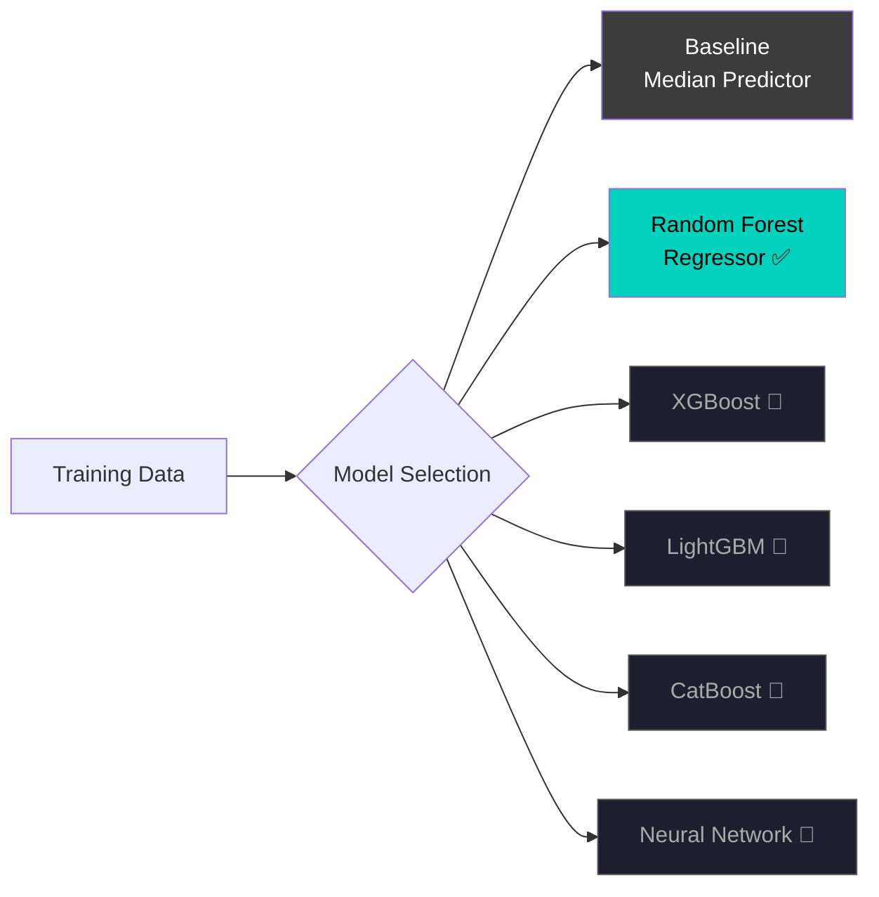
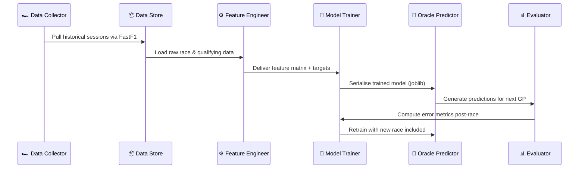
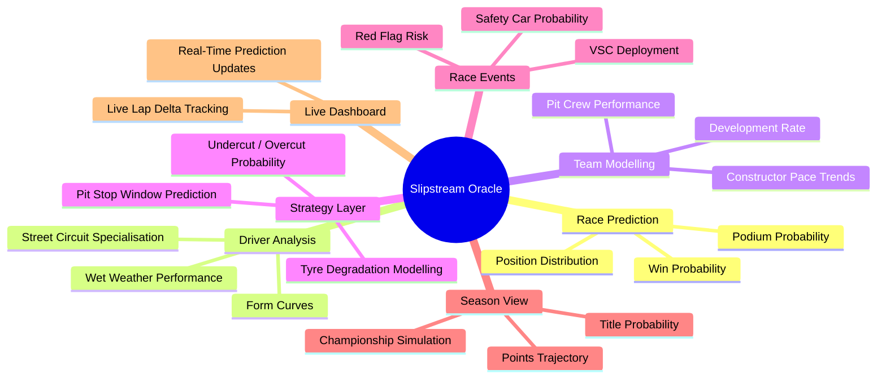

<div align="center">

<br/>

```
S L I P S T R E A M   O R A C L E
```

**Formula 1 Race Prediction Engine**

*Data flows in. Strategy comes out.*

<br/>

[](https://python.org)
[](https://docs.fastf1.dev/)
[](https://scikit-learn.org)
[]()
[]()

</div>

---

<br/>

The gap between winning and losing a Grand Prix is rarely decided at the apex of Turn 1. It is decided hours earlier — in spreadsheets, simulations, and probabilistic models running inside a strategy room. Slipstream Oracle is the engineering artifact of that obsession: a machine learning pipeline that ingests historical Formula 1 telemetry, constructs race-critical features, trains predictive models, and surfaces race outcome probabilities before lights go out.

This is not a weekend hackathon. It is a long-form engineering project built at the intersection of data science and motorsport — designed to grow sharper after every Grand Prix, every season, every iteration.

<br/>

---

## Table of Contents

- [Architecture](#architecture)
- [Data Collection](#data-collection)
- [Feature Engineering](#feature-engineering)
- [Machine Learning](#machine-learning)
- [Prediction Pipeline](#prediction-pipeline)
- [Repository Structure](#repository-structure)
- [Technology Stack](#technology-stack)
- [Current Status](#current-status)
- [Future Vision](#future-vision)
- [Why Slipstream Oracle Exists](#why-slipstream-oracle-exists)

---

<br/>

## Architecture

The full Oracle pipeline — from raw telemetry to race prediction — in a single pass:



<br/>

---

## Data Collection

> [!NOTE]
> Oracle's data layer is built on **FastF1** — the most comprehensive open-source Formula 1 telemetry library available. Every data point is cached locally to minimise API load and maximise reproducibility.

Oracle collects structured session data across **multiple Formula 1 seasons**, organised by Grand Prix and session type. Each race weekend is represented as a complete data package:

| Session Type | Contents | Purpose |
|---|---|---|
| **Race Results** | Finish positions, points, status, fastest lap | Primary prediction target |
| **Qualifying Results** | Grid positions, Q1/Q2/Q3 times, gap to pole | Starting grid feature |
| **Race Lap Data** | Sector times, tyre compounds, pit stop timing | Granular pace analysis |

**Collection is fully automated.** Specify a season range, run the collector, and Oracle builds its own structured data store — no manual downloads, no broken CSV pipelines.

```
data/
├── 2022/
│   ├── Bahrain_Grand_Prix/
│   │   ├── race_results.csv
│   │   ├── qualifying_results.csv
│   │   └── lap_data.csv
│   └── ...
├── 2023/
└── 2024/
```

<br/>

---

## Feature Engineering

> [!IMPORTANT]
> Raw race results are not enough. Oracle engineers temporal, contextual features that encode **driver form, consistency, and momentum** — the same signals a real strategy engineer watches on the pit wall.

A race result tells you what happened. A feature tells you *why it was likely to happen*.

Oracle constructs rolling statistical features over configurable windows, transforming raw event data into predictive signal:

### Driver Form Features

| Feature | Window | Signal |
|---|---|---|
| `avg_finish_last_3` | 3 races | Short-term momentum and recent form |
| `avg_finish_last_5` | 5 races | Medium-term consistency and trend |
| `avg_grid_position` | Season | Qualifying pace relative to field |
| `avg_points_last_5` | 5 races | Scoring consistency under pressure |
| `driver_dnf_rate` | Season | Reliability and incident history |

**Why these features matter:**

Rolling averages eliminate the noise of a single anomalous result — a safety car DNF, a mechanical failure outside the driver's control. They surface the underlying performance curve that a single data point obscures. A driver averaging P4 finishes over five races carries fundamentally different predictive weight than one who finished P4 once and P14 three times. Oracle learns to see that difference.

<br/>

---

## Machine Learning



### Current Implementation

**Baseline Predictor** — Establishes a performance floor by predicting the historical median finish position for each driver. Every subsequent model must beat this benchmark to justify its complexity. No exceptions.

**Random Forest Regressor** — The primary model. Trains on engineered driver and grid features to predict finish positions. Captures non-linear interactions between form metrics, grid slots, and track characteristics without requiring explicit feature crosses.

### Evaluation Protocol

Oracle evaluates every model against a consistent set of metrics:

- **MAE** — Mean Absolute Error in predicted finish positions
- **RMSE** — Root Mean Squared Error, penalising large prediction misses
- **Top-3 Accuracy** — Whether the model correctly identifies podium finishers
- **Position Rank Correlation** — Spearman correlation between predicted and actual finish order

### Upcoming Model Tiers

| Model | Expected Gain | Rationale |
|---|---|---|
| **XGBoost** | Regularisation, speed | Handles missing laps data gracefully |
| **LightGBM** | Large season datasets | Leaf-wise growth for deeper pattern capture |
| **CatBoost** | Categorical features | Circuit names, tyre compounds, team encoding |
| **Neural Network** | Sequence modelling | Long-form driver trajectory across a season |

<br/>

---

## Prediction Pipeline

> [!TIP]
> The full Oracle workflow is designed to be repeatable and automated. A new Grand Prix completes — Oracle ingests the results, re-engineers features, retrains if configured, and is ready for the next round within minutes.



<br/>

---

## Repository Structure

```
slipstream-oracle/
│
├── 📁 collectors/          # FastF1 data ingestion scripts
│   ├── session_collector.py      # Pull race, qualifying, lap sessions
│   └── batch_collector.py        # Multi-season bulk collection
│
├── 📁 features/            # Feature engineering modules
│   ├── driver_form.py            # Rolling avg finish, points, DNF rate
│   ├── grid_features.py          # Qualifying and grid position history
│   └── feature_builder.py        # Assembles final training matrix
│
├── 📁 models/              # Machine learning model definitions
│   ├── baseline.py               # Median predictor benchmark
│   ├── random_forest.py          # Primary RF regressor
│   └── evaluator.py              # MAE, RMSE, rank correlation metrics
│
├── 📁 predictions/         # Prediction generation scripts
│   ├── predict_race.py           # Generate pre-race finish predictions
│   └── predict_batch.py          # Bulk prediction across multiple GPs
│
├── 📁 outputs/             # Model outputs and prediction results
│   ├── predictions/              # CSV files of predicted finish orders
│   └── evaluations/              # Post-race error analysis reports
│
├── 📁 cache/               # FastF1 local session cache
│   └── (managed by FastF1)       # Prevents redundant API calls
│
├── 📁 data/                # Processed, structured race data
│   ├── 2022/                     # Season folders
│   ├── 2023/
│   └── 2024/
│
├── requirements.txt        # Python dependencies
└── README.md
```

<br/>

---

## Technology Stack

<div align="center">

| Layer | Technology | Role |
|---|---|---|
| **Language** |  | Core runtime |
| **F1 Telemetry** |  | Historical session data |
| **Data Processing** |  | Feature construction and manipulation |
| **Numerical** |  | Array operations and statistics |
| **Machine Learning** |  | Model training and evaluation |
| **Visualisation** |  | Performance plots and error charts |
| **Model Persistence** |  | Serialise and reload trained models |
| **Version Control** |  | Source control |
| **Hosting** |  | Repository and CI |

</div>

<br/>

---

## Current Status

> [!NOTE]
> Oracle is in active development. The core data and modelling pipeline is operational. Evaluation tooling and live prediction workflows are underway.

```
SYSTEM STATUS — SEASON 2024
─────────────────────────────────────────────────────
 ✅  Data Collection          Operational
 ✅  Session Organisation     Operational
 ✅  Feature Engineering      Operational
 ✅  Baseline Model           Operational
 ✅  Random Forest Model      Operational
 🚧  Model Evaluation Suite   In Development
 🚧  Feature Expansion        In Development
 🚧  XGBoost Integration      Queued
 🚧  Live Race Prediction     Queued
 🔲  Tyre Strategy Layer      Planned
 🔲  Weather Integration      Planned
 🔲  Championship Simulation  Planned
─────────────────────────────────────────────────────
```

<br/>

---

## Future Vision

The current Oracle is a foundation. These are the systems being engineered into it:



<br/>

---

## Why Slipstream Oracle Exists

> [!NOTE]
> This section is not about capability claims. It is about intent.

Formula 1 is the most data-saturated sport on earth. Thousands of sensors, hundreds of engineers, and decades of telemetry — and yet the outcome of a race still carries uncertainty that no model has ever fully resolved.

Slipstream Oracle exists for two reasons.

The first is straightforward: genuine passion for Formula 1 strategy. The decisions made on pit walls — when to box, when to push, when to trust the data and when to override it — are some of the most consequential applied probabilistic reasoning that happens under public scrutiny. That deserves to be modelled seriously.

The second is the engineering discipline it demands. Building a real, self-improving prediction system forces rigour in every layer: data pipeline design, feature selection, model evaluation, and the intellectual honesty to distinguish signal from noise. A prediction engine that cannot beat a simple median predictor is not a prediction engine — it is a statistical coincidence generator.

Oracle is not claimed to be production-grade race intelligence. It is a long-form, honest engineering project, built race by race, season by season, with the intention of getting meaningfully better at every iteration.

The gap between amateur prediction and professional strategy engineering is vast. Oracle is designed to close it, incrementally, with data.

<br/>

---

<div align="center">

<br/>

*The race does not give Oracle a second chance.*
*But every new Grand Prix gives it another one.*

<br/>

---

**Slipstream Oracle** · Built lap by lap

[](https://github.com)

</div>